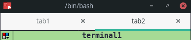
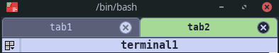

# Terminator terminal emulator catppuccin style narrow tab bar.

I really enjoy using terminator terminal emulator in my everyday work but its strict tab bar is not to my liking.

I'm not a css guru or anything like that but here is my terminator terminal emulator catppuccin style narrow tab bar
inspired by [terminator faq](https://gnome-terminator.readthedocs.io/en/latest/faq.html#make-the-active-tab-more-distinctive), [googling](https://gist.github.com/allen-munsch/6241ea674dac386596d80653b3e76d88) and some ChatGPT advice.

before:

after:

Just drop `gtk.css` into `~/.config/gtk-3.0/` and reopen all terminator instances.
